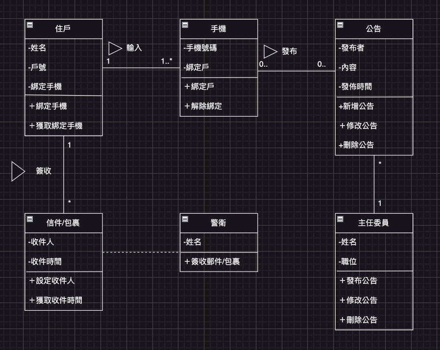
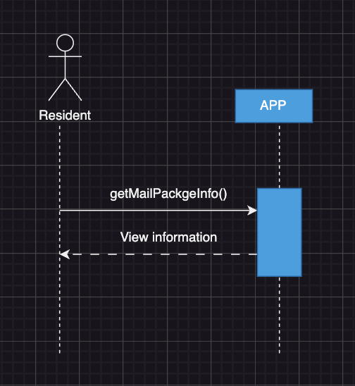
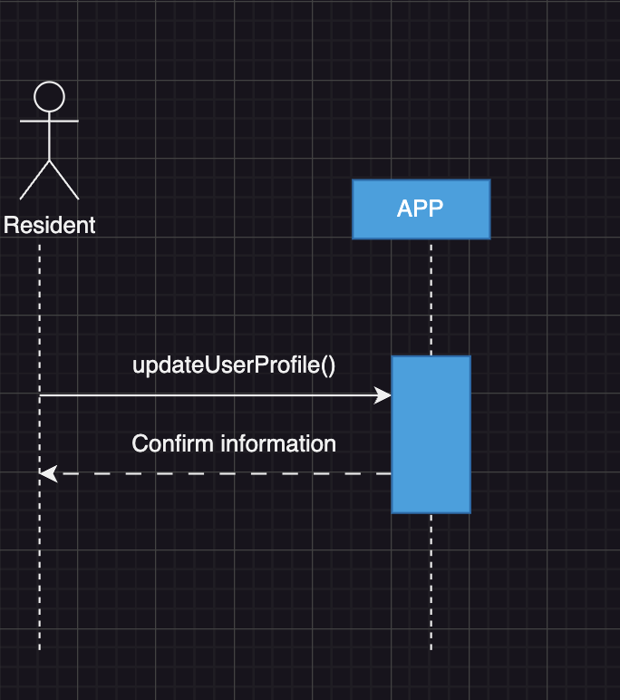
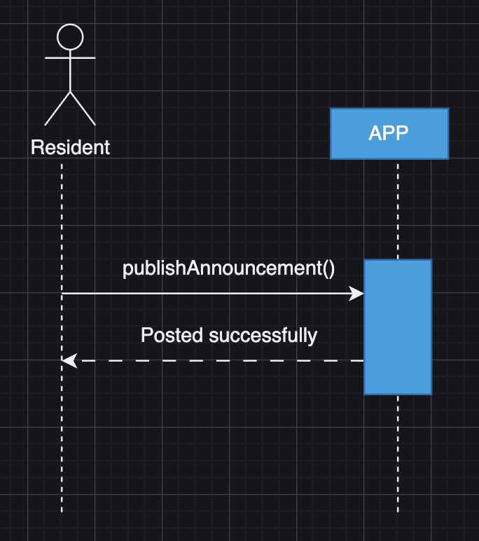
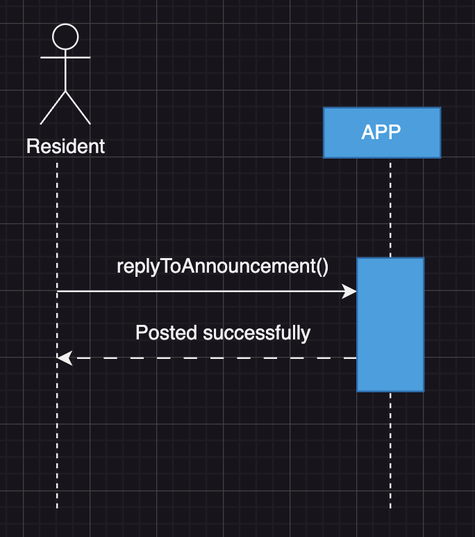
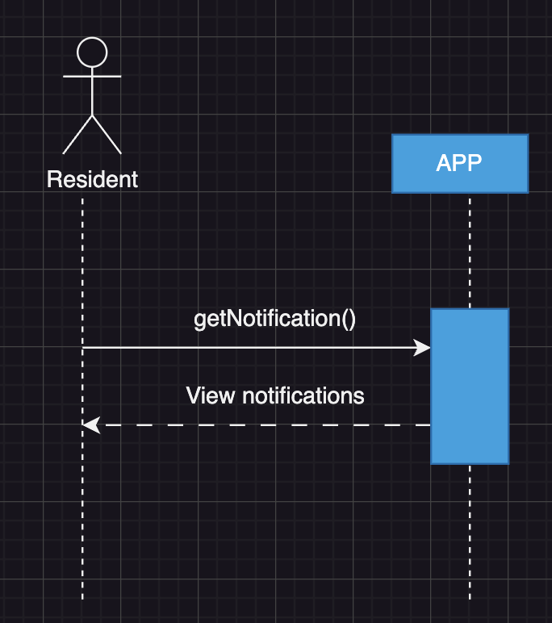

# 第4次作業-作業-HW4
>
>學號：111111117
> 
>姓名：林郁岑
> 
>作業撰寫時間：180 (mins，包含程式撰寫時間)
> 
>最後撰寫文件日期：2023/6/17
>

本份文件包含以下主題：(至少需下面兩項，若是有多者可以自行新增)
- [x] 說明內容
- [x] 個人認為完成作業須具備觀念

## 說明程式與內容
(a)初步類別圖 

 
(b)系統循序圖 
1.
 
2.
 
3.
 
4.
 
5.
 
(c)合約

| 合約1 | getMailPackgeInfo|
 | ---- | ---- | 
| 操作 | getMailPackgeInfo() | 
| 交互參照 | 使用案例：取得包裹訊息 |
| 前置條件 | 郵差或貨運公司送達信件或包裹。 | 
| 後置條件 | 包裹或信件的簽收信息錄入APP |

| 合約2 | updateUserProfile|
 | ---- | ---- | 
| 操作 | updateUserProfile | 
| 交互參照 | 使用案例：更新使用者資料 |
| 前置條件 | 包裹或信件已簽收並記錄住戶信息。 | 
| 後置條件 | 住戶收到APP推播簡訊通知。 |

| 合約3 | publishAnnouncement|
 | ---- | ---- | 
| 操作 | publishAnnouncement | 
| 交互參照 | 使用案例：發布公告 |
| 前置條件 | 發起者已登錄APP。 | 
| 後置條件 | 公告成功發布，所有綁定手機的住戶可以查看。 |

| 合約4 | eplyToAnnouncement|
 | ---- | ---- | 
| 操作 | replyToAnnouncement| 
| 交互參照 | 使用案例：回覆公告 |
| 前置條件 | 公告已發布。 | 
| 後置條件 | 住戶的回應成功顯示在公告下。 |

| 合約5 | getNotification|
 | ---- | ---- | 
| 操作 | getNotification| 
| 交互參照 | 使用案例：得到通知 |
| 前置條件 | 公告已順利發布。 | 
| 後置條件 | 用戶順利得到通知。 |

開始寫說明，需要說明本次作業個人覺得需學會那些觀念，亦可作為學習筆記使用 (需寫成文章，需最少50字，並且文內不得有你、我、他三種文字)
 
設計和使用社區大樓APP需學會信件包裹收發流程、公告管理操作、角色權限分配及前後置條件設定，這些觀念提升系統設計與管理效率，確保業務便捷有序。